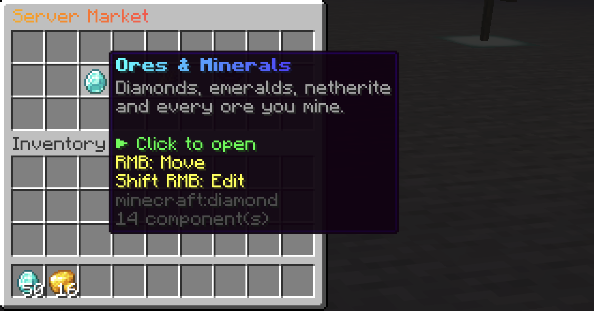
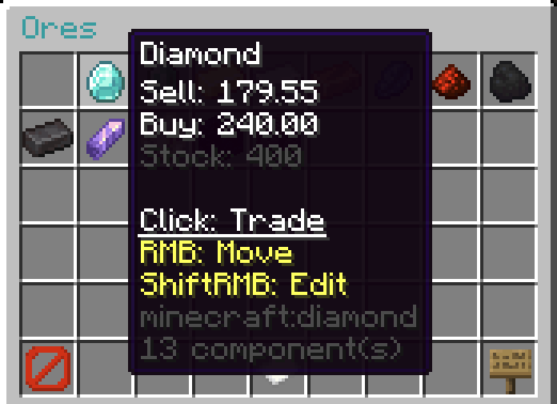
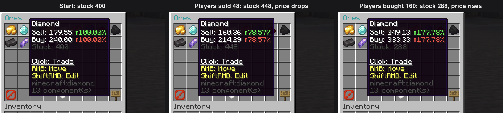
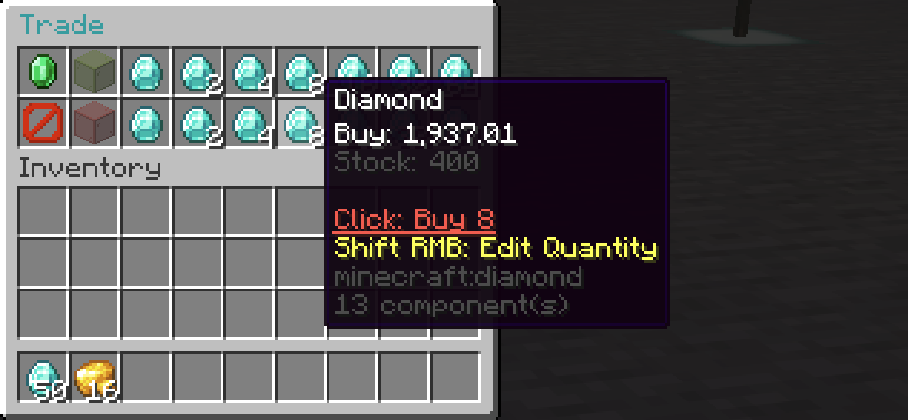
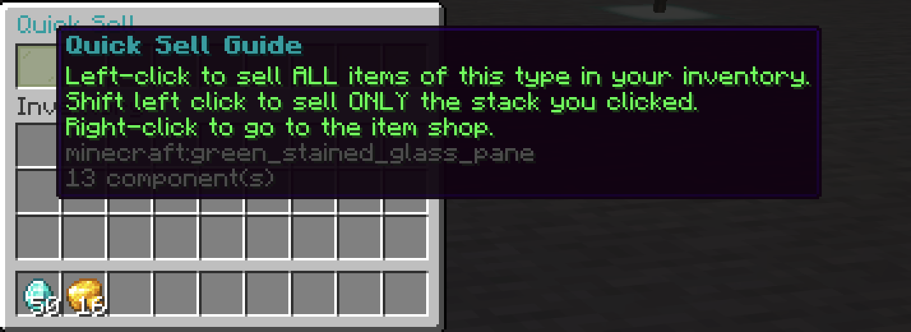
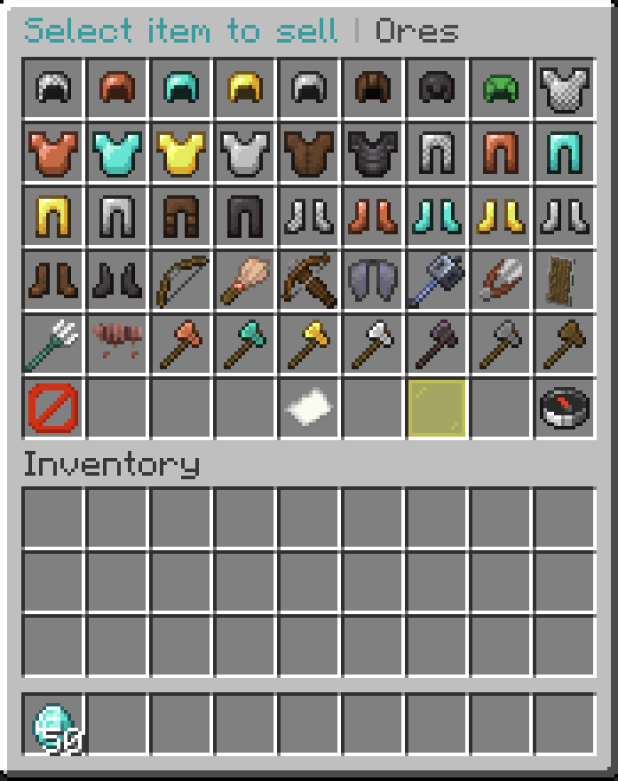
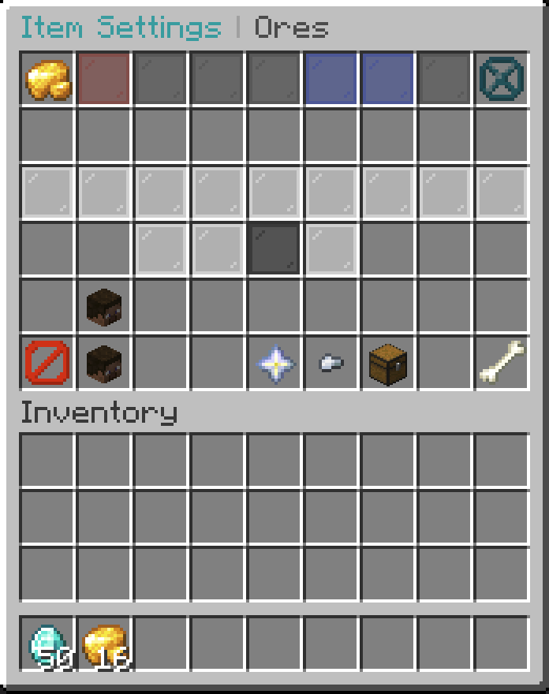
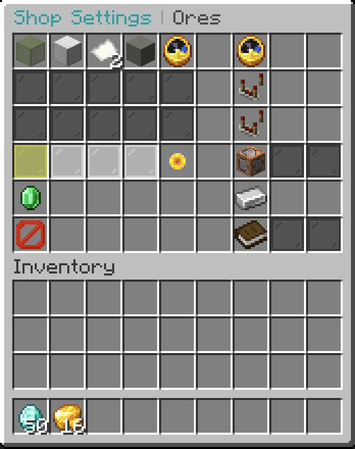
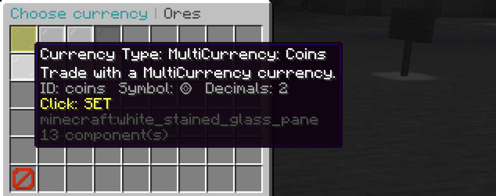

# 🛒 DynamicShop3 Fork

<p align="center">
  
  
  
  
</p>

<p align="center">
  A powerful and customizable dynamic shop plugin for modern Minecraft servers.
</p>

> A maintained fork of DynamicShop with additional Minecraft version support, Folia compatibility, broader economy support, bug fixes, and new features.

## ✨ Features

- 🖱️ **Add items straight from your inventory** — Click an empty shop slot, then click any item in your own inventory, and it is in the shop. No commands, no config files. Left-click to set its prices, right-click to place it as a decoration
- 🧬 **Full item data (NBT) support** — The whole item is stored and matched exactly: custom names, lore, enchantments, custom model data, plugin data (for example MMOItems or ItemsAdder items) and every other component. Players buy exactly the item you put in, and only that exact item can be sold back
- 📈 **Dynamic pricing** — Prices change based on shop activity and configured rules
- 🛒 **GUI-based shops** — Create and customize shops for your server
- 💰 **Multiple currencies** — Vault-compatible economies, PlayerPoints, Jobs Reborn points, and optional MultiCurrency
- 🌐 **Folia support** — Designed for Paper, Purpur, and Folia
- 🧩 **One jar for Minecraft 1.21 – 26.2** — The same release runs on every 1.21.x and 26.x server, tested on real servers for each version
- 🎨 **Modern text formatting** — Legacy colors, hex colors, gradients, and supported MiniMessage visual tags
- 🔄 **Shop rotations** — Configurable stock and rotating shops
- 📦 **Item metadata support** — Decorative items can optionally keep their names, lore, and tooltip information
- ⌨️ **Command items** — A shop item can run console commands when bought instead of giving the shown item, with its own coloured name and lore
- 🛡️ **Safe transactions** — Protection against incomplete and duplicate payments
- 💾 **Persistent data** — Unfinished MultiCurrency orders survive restarts and can be recovered safely
- 🔒 **Safe data files** — Files are saved atomically, and a YAML file with a typo is backed up and never overwritten
- 🔁 **Upgrade-safe settings** — Updates add new options and refresh untouched default texts automatically, without resetting your own changes

## 📸 Showcase

Screenshots from a real Purpur 26.2 server running DynamicShop 3.122.0.

<table>
  <tr>
    <td align="center" width="50%">
      <br>
      <b>Start page</b><br>
      Buttons with gradient names and coloured lore
    </td>
    <td align="center" width="50%">
      <br>
      <b>Shop</b><br>
      Live buy/sell prices and stock on every item
    </td>
  </tr>
  <tr>
    <td align="center" colspan="2">
      <br>
      <b>Dynamic pricing</b><br>
      Real trades on the test server: selling adds stock and lowers the price, buying removes stock and raises it
    </td>
  </tr>
  <tr>
    <td align="center">
      <br>
      <b>Trade</b><br>
      Buy or sell 1 to 64 at a time, priced by supply and demand
    </td>
    <td align="center">
      <br>
      <b>Quick sell</b><br>
      Sell every item of a type, or one stack, with one click
    </td>
  </tr>
  <tr>
    <td align="center">
      <br>
      <b>Add items from your inventory</b><br>
      Click an empty slot, then click any item
    </td>
    <td align="center">
      <br>
      <b>Item settings</b><br>
      Prices, median, stock and trade limits, all in the GUI
    </td>
  </tr>
  <tr>
    <td align="center">
      <br>
      <b>Shop settings</b><br>
      Permissions, hours, fluctuation, flags, currency, tax and logs
    </td>
    <td align="center">
      <br>
      <b>Currency selector</b><br>
      Vault, XP, Jobs points, PlayerPoints or any MultiCurrency currency
    </td>
  </tr>
</table>

## 🎮 Supported Platforms

| Platform | Support |
|---|---|
| Paper | ✅ |
| Purpur | ✅ |
| Folia | ✅ |

### Minecraft Versions

**1.21 – 26.2** (Paper, Purpur and Folia). One jar for all of them.

The plugin is built against the Minecraft 1.21 API for Java 21. Each release is started on real 1.21.x and 26.x servers to check that it loads, hooks the economy, creates a shop and reloads without errors.

Releases 3.22.0 – 3.121.1 only loaded on 26.2. Updating from one of them to this version needs no changes.

### Java

- **Running the server:** whatever your Minecraft version needs. That is Java 21+ for 1.21.x and Java 25+ for 26.x.
- **Building from source:** JDK 25+ (the build reads the MultiCurrency API, which is Java 25 bytecode). The jar it produces runs on Java 21.

## 💰 Economy & Currency Support

| Integration | Type | Description | Link |
|---|---|---|---|
| Vault-compatible Economy | Economy | Works with Vault API-compatible economy providers | [Vault](https://www.spigotmc.org/resources/vault.34315/) |
| PlayerPoints | Points | Use PlayerPoints as a shop currency | [PlayerPoints](https://www.spigotmc.org/resources/playerpoints.80745/) |
| Jobs Reborn | Points | Use Jobs Reborn points as a shop currency (`JobPoint`) | [Jobs Reborn](https://www.spigotmc.org/resources/jobs-reborn.4216/) |
| MultiCurrency | Currency | Use server-defined currencies such as Coins, Gems, and Tokens | [MultiCurrency](https://github.com/Cupjok/MultiCurrency) |

MultiCurrency is optional and uses the plugin's public API with transaction protection and recovery for unfinished orders.

## 📈 Dynamic Pricing

DynamicShop3 can adjust prices based on shop activity, including buying, selling, stock levels, and configured pricing rules.

This allows servers to create economies where item prices naturally change over time.

## 🎨 Modern Text & Colors

Shop titles, the start page, buttons, names, and lore support modern formatting, including:

- Legacy colors such as `&a` and `§a`
- Hex colors such as `&#FF5555` and `#FF5555`
- `&x&F&F&5&5&5&5` hex formatting
- MiniMessage visual tags such as `<#FF5555>`, `<bold>`, `<italic>`, `<gradient>`, and `<rainbow>`

Normal text such as `R&D Shop` and `Shop & More` remains unchanged.

## ⌨️ Command Items

In a shop, Shift + right-click an item to open its settings, then click **Item type** to turn it into a command item
(the item has to be saved to the shop first). The command item editor opens:

- **Add command** — type a command in chat, with or without `/` (it is saved, not run). Click a command to edit it, right-click to delete it.
  Placeholders: `{player}`, `{uuid}`, `{shop}`.
- **Rename** / **Change lore** — the name and lore shown in the shop. They support every colour format listed above.
  In lore, `\n` starts a new line. Right-click resets them.

When a player buys a command item, its commands run from the console once per unit bought, and the shown item is
not given. Command items cannot be sold to the shop. Price, stock, discounts and trade limits work as for normal items.

## 🎮 Commands

Main command `/dynamicshop`, alias `/ds`. Every `/ds shop <shop> …` command also works from the console.

**Players**

| Command | Description |
|---|---|
| `/ds` | Open the start page (or the default shop) |
| `/ds shop [<shop>]` | Open a shop |
| `/shop [<shop>]` | Same as `/ds shop` (if `Command.UseShopCommand` is on) |
| `/ds qsell` | Quick sell menu |
| `/sell hand` | Sell the stack in your hand |
| `/sell handall` | Sell every item like the one in your hand |
| `/sell all` | Sell everything a shop buys. Other items stay, and nothing is ever sold for 0 |

If another plugin also owns `/sell`, use `/dynamicshop:sell all`.

**Admins**

| Command | Description |
|---|---|
| `/ds createshop <shop> [<permission>]` | Create a shop (created disabled) |
| `/ds deleteshop <shop>` | Delete a shop |
| `/ds renameshop <old name> <new name>` | Rename a shop |
| `/ds copyshop <shop> <new name>` | Copy a shop |
| `/ds mergeshop <shop1> <shop2>` | Merge two shops |
| `/ds openshop [<shop>] <player>` | Open a shop for another player |
| `/ds setdefaultshop <shop>` | Set the default shop |
| `/ds settax <value>` / `/ds settax temp <value> <minutes>` | Global sales tax in %, or a temporary one |
| `/ds reload` | Reload files |
| `/ds iteminfo` | Price information for the item in your hand |
| `/ds deleteOldUser <days>` | Remove old player data |
| `/ds cmdHelp <on \| off>` | Show command help while typing |
| `/ds shop <shop> add <item> <value> <median> <stock>` | Add an item by material name (a longer form also takes min/max value) |
| `/ds shop <shop> addhand <value> <median> <stock>` | Add the item in your hand, with its full item data |
| `/ds shop <shop> edit …` / `editall …` | Edit one item / all items |
| `/ds shop <shop> enable <true \| false>` | Enable or disable a shop |
| `/ds shop <shop> currency \| permission \| flag \| sellbuy \| shophours \| fluctuation \| stockStabilizing \| account \| log \| command \| position \| maxpage \| background …` | Shop settings |

Every setting is also available in the GUI. The full syntax is on the [Commands wiki page](https://github.com/Cupjok/DynamicShop3/wiki/Commands).

## 🔐 Permissions

| Permission | Default | Description |
|---|---|---|
| `dshop.use` | `true` | `/ds`, opening shops |
| `dshop.sell` | `true` | `/sell hand`, `/sell handall`, `/sell all` |
| `dshop.use.qsell` | `true` | `/ds qsell` quick sell menu |
| `dshop.admin.shopedit` | op | Edit shops: add/move items, item and shop settings, `/ds shop <shop> …` edit commands |
| `dshop.admin.createshop` | op | `/ds createshop` |
| `dshop.admin.deleteshop` | op | `/ds deleteshop` |
| `dshop.admin.renameshop` | op | `/ds renameshop` |
| `dshop.admin.copyshop` | op | `/ds copyshop` |
| `dshop.admin.mergeshop` | op | `/ds mergeshop` |
| `dshop.admin.editall` | op | `/ds shop <shop> editall` |
| `dshop.admin.openshop` | op | `/ds openshop` |
| `dshop.admin.setdefaultshop` | op | `/ds setdefaultshop` |
| `dshop.admin.settax` | op | `/ds settax` |
| `dshop.admin.reload` | op | `/ds reload` |
| `dshop.admin.iteminfo` | op | `/ds iteminfo` |
| `dshop.admin.deleteOldUser` | op | `/ds deleteOldUser` |
| `dshop.admin.createsign` | op | Create shop signs |
| `dshop.admin.destroysign` | op | Break shop signs |
| `dshop.admin.remoteaccess` | op | Use local/sign shops from anywhere |
| `dshop.admin.creative` | op | Use shops in creative mode |

A shop can also require its own permission (`/ds shop <shop> permission true` → `dshop.user.shop.<shop>`). A player with only `<permission>.sell` can still sell to that shop through `/sell` and quick sell.

## 🛠️ Installation

1. Download the latest DynamicShop3 release.
2. Place the `.jar` file into your server's `plugins` folder.
3. Install the economy and optional integration plugins you want to use.
4. Start or restart the server.
5. Configure DynamicShop3 in `plugins/DynamicShop/`.

## ⬆️ Updating & Upgrading from the Original DynamicShop

Updating is always **replace the jar and restart**. You never need to delete `config.yml`, the language files or any shop file.

- Your shops, settings, start page, custom texts and player data are kept.
- New options are added to your files automatically.
- Default texts you never changed are refreshed when a new version changes them. Texts you edited yourself are kept, and the console tells you when a newer default exists.
- A data file with a YAML typo is not overwritten. A `.broken-<time>` copy is kept, the console says which file it is, and you can fix it and run `/ds reload`.

**Coming from the original DynamicShop (sat7, up to 3.120.2)?** Drop this jar in place of the old one. It uses the same `plugins/DynamicShop/` folder. A full migration from upstream 3.120.1 data was tested: every shop, flag, price, discount, trade limit, shop account, custom item (name, lore, enchantments), start-page button, config value and custom text was kept, and buying worked the same as before. The original jars do not load on Minecraft 26.x, so switching is required there anyway.

Things that behave differently from the original:

- **Quick sell:** left-click sells **all** items of that type, Shift + left-click sells only the clicked stack. The guide text in the menu is updated automatically.
- **`/sell all`, `/sell hand` and quick sell never take items for nothing.** The original removed items whose sell payout rounded to 0 (for example a sell price set to 0, or a delivery charge larger than the price) and paid 0. These items are now refused and stay in the inventory.
- Everything in the ✨ Features list above applies to your existing shops right away.

As with any plugin update, keep a backup of `plugins/DynamicShop/` before updating.

## 🤖 Using AI Agents to Develop DynamicShop3

This repository includes project-specific guidance for AI coding agents. You do **not** need to explain the entire architecture to an AI agent every time you want to make a change.

Before modifying the project, an AI agent should read these files:

1. **`CLAUDE.md`** — project architecture, important implementation rules, build/test commands, compatibility requirements, Folia scheduling rules, integrations, and development conventions.
2. **`HANDOFF.md`** — the current development state, recent work, known issues, and anything that the previous AI session intentionally left for the next session.

`CLAUDE.md` is named for Claude Code, but the information is **not exclusive to Claude**. Claude Code, Codex, Gemini CLI, Cursor agents, GitHub Copilot coding agents, and other AI coding tools can use the same files as repository guidance.

### Recommended workflow

Give your AI coding agent a short instruction like this:

```text
First, read CLAUDE.md and HANDOFF.md in this repository and follow their instructions.
Then inspect the relevant existing code and tests before making changes.

[Describe what you want to change here]

Implement the change while preserving the existing architecture and compatibility rules.
Run the appropriate build/tests after the change and report what was changed, what was tested, and any remaining concerns.
```

For example:

```text
First, read CLAUDE.md and HANDOFF.md.
Then inspect the existing shop transaction code.

I want to add [describe the feature or bug fix].
Please implement it using the existing project conventions. Do not redesign unrelated parts of the plugin.
Run the relevant tests and `mvn clean package` when appropriate, then summarize the result.
```

### For a bug fix

```text
Read CLAUDE.md and HANDOFF.md first.

There is a bug where [describe the observed behavior].
Please investigate the existing implementation, identify the root cause, fix it with the smallest appropriate change, and add or update a regression test if practical.

Run the relevant tests and build, then report the root cause and verification results.
```

### For a new feature

```text
Read CLAUDE.md and HANDOFF.md first.

I want to add this feature:
[describe the feature and expected behavior]

Inspect the existing architecture and implement this in the way that best fits the project. Reuse existing utilities and patterns where appropriate and avoid unrelated refactors.

Update documentation or release notes if the change is user-visible. Run the relevant tests/build and summarize the implementation and verification.
```

### Important for AI agents

- **Read the repository guidance before coding.** Do not start by blindly changing files.
- **Inspect existing code before designing a new system.** DynamicShop3 already has established patterns for configuration, scheduling, transactions, localization, integrations, and GUI code.
- **Do not remove or weaken safety rules** documented in `CLAUDE.md`, especially transaction handling and Folia scheduling requirements.
- **Do not make unrelated refactors** unless they are necessary for the requested change.
- **Run tests/builds after changes** and report failures instead of assuming the implementation is correct.
- **Keep `HANDOFF.md` useful** when a task leaves important unfinished work, decisions, or follow-up information for the next AI session.

This workflow also makes it possible to switch between different AI coding agents without having to rebuild the project's context from scratch.

## 📚 Documentation

Detailed configuration, shop setup, commands, permissions, and integrations can be documented in the repository Wiki.

## 🔧 Development

DynamicShop3 is maintained as a modern fork with a focus on current Minecraft server compatibility.

### Building from source

Requirements:

- Java 25+
- Maven
- Paper API 26.2

For contributors and developers, read **`CLAUDE.md`** first for project architecture, development conventions, build information, Folia scheduler conventions, and other important implementation rules. Then read **`HANDOFF.md`** for the current development state.

## 🔗 Links

- **Source:** [GitHub](https://github.com/Cupjok/DynamicShop3)
- **Free Version:** [SpigotMC](https://www.spigotmc.org/resources/65603/)
- **Premium Version:** [SpigotMC](https://www.spigotmc.org/resources/100058/)
- **MultiCurrency:** [GitHub](https://github.com/Cupjok/MultiCurrency)
- **Discord:** [Join the community](https://discord.gg/5HQjBqU)
- **Statistics:** [bStats](https://bstats.org/plugin/bukkit/DynamicShop)

---

### Credits

DynamicShop3 is a maintained fork of the original DynamicShop project.

Additional development includes Minecraft 26.2 support, Folia compatibility, expanded economy integrations, MultiCurrency support, bug fixes, and other improvements.
